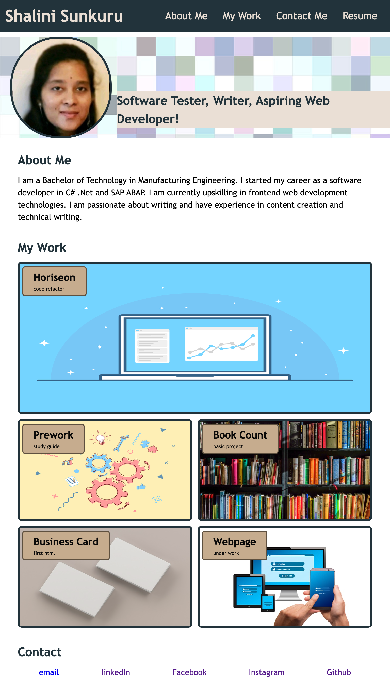

# Portfolio Webpage - Shalini Sunkuru
A basic portfolio page made using html and css

## Description

The aim of this project was to make a portfolio webpage so that potential employers can easily view and navigate through my profile and web development projects. 

This was achieved by following the below user story and acceptance criteria closely and using the knoweldge gained till now in HTML and CSS including CSS flexbox and CSS grid and pseudo classes for hover styles. 

Version control was through git and the updated repository can be found at:

https://github.com/ShaliniSunkuru/ch2-portfolio-shalini-sunkuru

## Table of Contents

- User Story
- Acceptance Critera
- Screenshot
- Technology Used
- Deployment
- Usage

## User Story

AS a web developer
I WANT a webpage where I can showcase my profile and projects
SO THAT potential employers will find it easy to know more about my candidature

## Acceptance Criteria

GIVEN a url for basic portfolio website
WHEN I click to open the url
The loaded page has my profile picture, name, links to sections about me, my work, and my contact
WHEN the links in the navigation are clicked,
The corresponding section is scrolled to
WHEN I view the portfolio projects
The section has titles images of my work,
WHEN I view the portfolio projects
The first application is larger than the others
WHEN the projects are clicked
The deployed application opens,
WHEN the page is resized or viewd on different screens
The layout is responsive and adapts to my viewport,

## Screenshot

Here is a screenshot of the deployed website when opened using its URL on a desktop.

## Technology Used

The following tools and technologies were used in this project

- HTML5
- CSS
- Visual Studio Code
- GIT
- Github
  
## Deployment

Here is a link to the deployed website. Click it and explore.

https://shalinisunkuru.github.io/ch2-portfolio-shalini-sunkuru/

## Usage

Click on the url for the deployed project. Click on the links in the navigation bar to be taken to the respective section. Click on the project images to view the deployed appplication. Click on the links in the contact me section to view me on linkedIn, Github and others. Notice the hover effects on links and projects. Resize the page to see a responsive layout. Enjoy! And get in touch!

## Credits

I appreciate the guidance of the instrutor and TAs of edX Bootcamp. W3Schools, freecodecamp and stack overflow have been a great help in grasping the concepts of CSS. 

## License

MIT 

